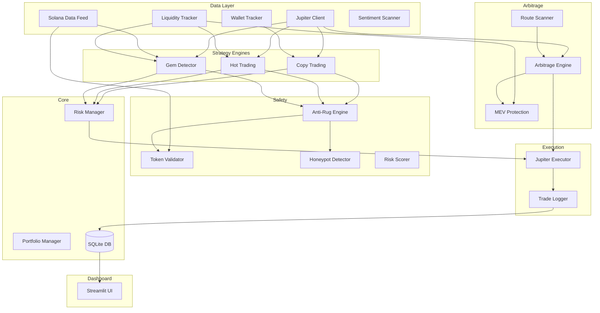

# SolanaJupiterBot v2.0

Automated Solana trading bot using the **Jupiter DEX aggregator**. Supports copy trading, momentum trading, hidden gem detection, and cross-route arbitrage — all executed through Jupiter's swap infrastructure.

## Architecture



## System Flow

```
Market Data → Strategy Engines → Signal Scoring → Anti-Rug Engine
→ Risk Manager → Execution Engine (Jupiter) → Trade Logger → Dashboard UI

Arbitrage Engine runs as a parallel system.
```

## Features

| Module | Description |
|--------|-------------|
| **Copy Trading** | Mirrors profitable smart money wallet trades |
| **Hot Trading** | Momentum-based entries on volume spikes |
| **Gem Detector** | Finds undervalued newly listed tokens |
| **Arbitrage Engine** | Cross-route Jupiter arbitrage with MEV protection |
| **Anti-Rug Engine** | Mint/freeze authority, honeypot, holder analysis |
| **Risk Manager** | 2% per-trade risk, 5% daily drawdown auto-shutdown |
| **Dashboard** | Real-time Streamlit UI with portfolio, strategy, and trade panels |

## Setup

### Prerequisites

- Python 3.12+
- pip

### Installation

```bash
# Clone the repository
git clone https://github.com/ahmadabuadas2025/trading-bot.git
cd trading-bot

# Create virtual environment
python3.12 -m venv .venv
source .venv/bin/activate

# Install dependencies
pip install -r requirements.txt

# Install dev dependencies (optional)
pip install -e ".[dev]"
```

### Environment Variables

Copy the example environment file and fill in your keys:

```bash
cp .env.example .env
```

| Variable | Description | Required |
|----------|-------------|----------|
| `WALLET_PRIVATE_KEY` | Solana wallet private key (base58) | Live mode only |
| `HELIUS_API_KEY` | Helius RPC API key for enhanced data | Optional |
| `BIRDEYE_API_KEY` | Birdeye API key for liquidity data | Optional |
| `LUNARCRUSH_API_KEY` | LunarCrush API key for sentiment | Optional |

## Usage

### Paper Trading (Default)

```bash
python main.py --mode paper
```

Starts the bot in simulation mode with a $1,000 virtual balance. No real transactions are executed.

### Live Trading

```bash
python main.py --mode live
```

> **⚠️ WARNING:** Live mode executes real transactions on Solana mainnet. Ensure your wallet is funded and you understand the risks.

### Dashboard

```bash
streamlit run dashboard.py
```

Opens a real-time dashboard at `http://localhost:8501` with:
- **Portfolio**: Balance, PnL, equity curve, win/loss ratio
- **Strategies**: Per-strategy performance panels
- **Arbitrage**: Live opportunities and execution history
- **Trade Logs**: Filterable log table with CSV export

### CLI Options

```
python main.py --help

Options:
  --mode {paper,live}   Trading mode (overrides config.yaml)
  --config CONFIG       Path to config file (default: config.yaml)
```

## Configuration

All parameters are in `config.yaml`. Key sections:

| Section | Key Parameters |
|---------|---------------|
| `risk` | `max_risk_per_trade_pct: 0.02`, `max_daily_drawdown_pct: 0.05` |
| `copy_trading` | `min_liquidity_usd: 50000`, `min_wallet_win_rate: 0.55` |
| `hot_trading` | `volume_spike_multiplier: 3.0`, `max_hold_seconds: 120` |
| `gem_detector` | `min_holders: 100`, `take_profit_multiplier: 3.0` |
| `arbitrage` | `min_profit_threshold_pct: 0.003`, `scan_interval_seconds: 2` |
| `safety` | `max_risk_score: 50`, `honeypot_check_enabled: true` |

## Module Descriptions

### Core (`core/`)
- **config.py** — YAML + .env config loader with Pydantic validation
- **logger.py** — Structured logging via loguru (JSON file + console)
- **database.py** — Async SQLite layer using aiosqlite
- **schema.py** — Database table initialization
- **risk_manager.py** — Trade risk enforcement (per-trade, daily drawdown)
- **portfolio_manager.py** — Balance, allocation, and position tracking
- **models.py** — Pydantic data models (Trade, Token, Signal, etc.)

### Data (`data/`)
- **jupiter_client.py** — Jupiter Quote/Swap/Price API client
- **solana_data.py** — Token metadata via Solana RPC / Helius
- **wallet_tracker.py** — Smart money wallet transaction tracking
- **liquidity_tracker.py** — Pool liquidity monitoring and spike detection
- **sentiment_scanner.py** — External sentiment API hooks

### Strategies (`strategies/`)
- **copy_trading.py** — Mirrors profitable wallet trades
- **hot_trading.py** — Volume spike / momentum entries
- **gem_detector.py** — New token pair discovery with quality filters

### Arbitrage (`arbitrage/`)
- **route_scanner.py** — Multi-route comparison via Jupiter
- **arbitrage_engine.py** — Detection, validation, and execution loop
- **mev_protection.py** — Pre-execution price re-check and route safety

### Safety (`safety/`)
- **token_validator.py** — Mint/freeze authority, holder concentration
- **honeypot_detector.py** — Buy/sell simulation via Jupiter quotes
- **anti_rug.py** — Orchestrates all safety checks
- **risk_scorer.py** — 0–100 risk scoring with configurable weights

### Execution (`execution/`)
- **jupiter_executor.py** — Full swap pipeline (quote → simulate → execute)
- **trade_logger.py** — SQLite trade persistence

### Dashboard (`dashboard/`)
- **app.py** — Streamlit main app with sidebar navigation
- **pages/** — Portfolio, strategies, arbitrage, and trade log pages
- **components/** — Reusable Plotly charts and metric cards

## Testing

```bash
# Run all tests
pytest

# Run with verbose output
pytest -v

# Run specific test file
pytest tests/test_risk_manager.py
```

## Risk Disclaimer

> **This software is provided for educational and research purposes only.**
>
> - Trading cryptocurrency involves significant risk of financial loss.
> - Past performance does not guarantee future results.
> - Never trade with funds you cannot afford to lose.
> - The authors are not responsible for any financial losses incurred.
> - Always start with paper trading mode to understand the system behavior.
> - Live mode requires careful configuration and monitoring.

## License

MIT
